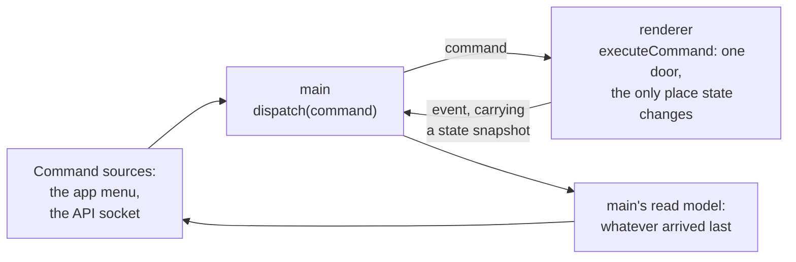

# Architecture

The goal of this document: keep the app simple *on purpose*. It records the
structure, the reasoning behind it, and the rules for growing it without
wrecking it. Terms are defined in [GLOSSARY.md](GLOSSARY.md); the data-flow
walkthrough lives in [README.md](README.md).

## Why Electron, not a TUI

This app could have been a TUI, a program that draws its interface inside an
existing terminal, the way vim or lazygit do. We chose Electron instead, and
the reason shapes everything that follows: **the terminal grid should be one
view inside the app, not the ceiling of what the app can show.**

A TUI can only ever paint character cells. Electron gives us a full Chromium
page around the terminal, which buys three things:

1. **Comfortable rich content.** Reading a Markdown file should mean real
   typography (headings, proportional fonts, images), not raw `#` marks in a
   grid. Anything the web can render, a view in this app can render.
2. **Integrated browser views.** Embedding a live web page next to the
   terminal is nearly free in Electron; in a TUI it's impossible.
3. **Integrated project reading.** A project panel combines a lazy file
   tree and a Monaco editor showing one file, without turning the terminal
   into an editor. The editor is read-only: lmux shows files, it does not write
   them.

These capabilities exist as terminal and Markdown tab kinds, plus the project
panel a workspace keeps beside its panes. Each owns its renderer-side content
while sharing the workspace and the command bus.

## The one idea

A terminal emulator is naturally two halves, and they were literally two
machines in 1978: a dumb screen-and-keyboard (the VT100) and a computer,
joined by a serial cable. We keep that exact split:

| 1978                  | This app                              |
| --------------------- | ------------------------------------- |
| VT100 (screen + keys) | renderer process running xterm.js     |
| serial cable          | IPC channel (the bridge's messages)   |
| the computer          | main process holding a PTY + zsh      |

Everything in the codebase is on one side of that cable or the other. When a
new feature comes along, the first design question is always: **which side
does this belong on, and does the cable need to change?**

## The boundary

The entire contract between the two halves is `window.bridge`, declared once as
a type and implemented by the preload script:

```
spawnShell(id, cols, rows)   renderer → main   "start a shell for tab `id` at this size"
writeToShell(id, data)       renderer → main   "the user typed these bytes in tab `id`"
resizeShell(id, cols, rows)  renderer → main   "tab `id` is now this size"
killShell(id)                renderer → main   "kill tab `id`'s shell"
onShellData((id, data))      main → renderer   "tab `id`'s shell produced these bytes"
onShellExit((id))            main → renderer   "tab `id`'s shell has exited"
onCommand(callback)          main → renderer   "execute this Command" (see below)
emitEvent(event)             renderer → main   "this Event just happened" (see below)
showTabMenu(id)              renderer → main   "right-click on tab `id`: show its native menu"
onRenameRequest((id))        main → renderer   "the user picked Rename in tab `id`'s menu"
showWorkspaceMenu(id)        renderer → main   "right-click on workspace `id`: show its native menu"
onWorkspaceRenameRequest((id)) main → renderer "the user picked Rename in workspace `id`'s menu"
closeWorkspace(id)           renderer → main   "the × on workspace `id`'s row: guard the shells it would kill"
readFile({path, baseTabId})  renderer → main   "read a document or project file" (request/response)
readProjectTree({...})       renderer → main   "resolve a root and list one directory" (request/response)
readSession()                renderer → main   "what did the last run leave to rebuild?" (request/response)
onScreenRead({readId, ...})  main → renderer   "what is tab `id` showing?" (request/response, the only one this way)
answerScreenRead({readId, result}) renderer → main "here is what it shows"
```

Rules that keep this boundary healthy:

1. **The shell protocol carries only bytes, sizes and tab ids.** No
   file paths, no structured objects. The renderer never knows what shell
   is running; the main process never knows how the screen is drawn. The
   one deliberate exception is the command bus (next section): a pair of
   channels carrying typed `Command`/`LmuxEvent` objects, whose shapes are
   declared once and compile-checked on both sides. The screen query is
   the same exception in the other direction, and for the same reason: the
   answer is characters, which only the renderer holds.
2. **The renderer stays a dumb screen.** Anything that touches the OS
   (processes, files, clipboard writes are the one pragmatic exception)
   belongs in main.
3. **Grow the protocol, don't bypass it.** A new capability means a new,
   explicitly named message in the preload script, never widening the sandbox or
   exposing Node.js to the page.

This is also the security model (see "Preload script" in the glossary): the
page can only ever do what these functions allow. One rule outside the
bridge serves the same purpose: **the page is never allowed to navigate.**
The window *is* the app, so following a link would replace the sidebar,
the workspaces and every terminal with a web page, unrecoverably. Main
cancels every `will-navigate` and denies every window-open, handing http,
https and mailto URLs to the browser instead and dropping the rest; the
renderer never decides what may reach the OS.

A note on the Content-Security-Policy, because Electron complains about it
at every launch. **The warning is a false positive and the policy is
enforced.** Electron's check reads the *response headers*, and a `file://`
page has none: the only headers our page comes back with are
`Content-Type` and `Last-Modified`. It therefore cannot see the `<meta
http-equiv>` policy the page itself carries and assumes there is none. Measured
against the running app, that policy is doing its job: `eval` and `new
Function` both throw `EvalError`, an injected inline `<script>` never
runs, and `fetch` to a remote host is refused. The warning also only
prints in development, since Electron silences these for a packaged app.
It is left switched on rather than muted, so a *real* warning is still
visible later. The genuine loosenings are `style-src 'unsafe-inline'`, which
Dockview and xterm require because they inject `<style>` blocks at runtime and
offer no way to carry a nonce, and `font-src data:`, which loads Monaco's
bundled, non-executable Codicon font.

## The command bus: the public interface

The most important seam in the project. Everything lmux can do is
expressible as a **Command** (an imperative request: "open a tab", "type
this text"), and everything that happens is announced as an **Event** (a
fact: "tab 3 opened", with a snapshot of the resulting state). The two
unions *are* lmux's public API, and they are where to start reading.



A Command is a request, not a transaction: it is answered with however many
Events its work produced, which may be none. `close-workspace` on the last
workspace returns silently, an already-active workspace activates to
nothing, and a workspace renaming itself after its tab did rides out inside
that tab's Event rather than announcing itself twice. An observer waits for
the state it wants, rather than for a reply.

The rule that keeps the API honest: **every UI affordance goes through a
command**. The × button, the + button, clicking a tab, ⌘T: none of them
call lmux's functions directly; they all issue the same Commands an
external caller would. The UI is just the first API client, so the API
can never lag behind the UI.

Two consequences worth naming:

- **Events carry a state snapshot** (`{workspaces, activeWorkspaceId}`, each
  workspace holding its own tabs, layout and active tab), so an observer
  never needs a query protocol: whatever arrives last is the truth. Main
  keeps the latest snapshot as the read model the API socket answers from.
- **There are three doors, and they are the same door.** The app menu, the
  devtools console (`window.lmux.command({type: "new-tab"})` in ⌥⌘I), and
  the API socket an agent drives all issue the same Commands into the same
  switch. Adding the socket cost no change to the bus at all: it is a
  second caller of `dispatch`, which is exactly what this design was for.

## The parts

The layout mirrors this document: two sides, the cable between them, and the
public interface above both.

**The public interface** is the Command and Event unions, the state and settings
shapes they carry, the session schema a restart is rebuilt from, and the theme
palettes both sides import.

**The cable** is one declared contract type and the preload script implementing
it.

**Main owns the machine.** It boots the window and the app lifecycle, keeps one
PTY per tab and relays its bytes, builds the app and context menus, dispatches
Commands into the renderer and keeps the read model Events arrive in, serves the
API socket, reads files and directories with their Git status and watches them,
and writes the window geometry and the last session to disk.

**The renderer owns the screen.** It boots settings into CSS and wires the
cable, keeps the workspace store (one layout and one project panel each) and the
tab store whose one dispatcher hands every Command to its family, draws the
window's own furniture (title bar, sidebar, modals), the strip's tab rows and
the terminal and Markdown panes, hosts the project panel with its lazy tree, its
one open file and Monaco, and owns the settings and the drag handles. Everything
in it that is a view of state is a React component; everything that hosts
somebody else's DOM, or answers a pointer, is not.

**The tests** boot the real app, drive the bus, and assert on the state that
comes back.

A reader who knows the architecture can predict where anything lives; a module
that stops fitting a one-line description of its job is a module that wants
splitting.

## Decisions so far

Each entry: what we chose, and why. If a decision stops making sense, we
change it and update this list.

- **TypeScript, compiled by `tsc`.**
  (Replaced the original "plain JavaScript, no build step" decision.) Node
  22.18+ (including the Node 24 inside our Electron) can *run* `.ts` files
  natively by stripping the type annotations, but that gets us nothing on its
  own: stripping isn't checking, and the renderer runs in Chromium, which
  can't run TypeScript at all. So the one tool is the official compiler:
  `tsc` type-checks the whole source tree and emits plain JS. Cost we
  accept: a compile step inside `npm start`. (Amended 2026-08-08: the
  no-bundler rule no longer extends to every dependency. Amended 2026-08-15:
  it no longer covers the page either — see the entry below. `tsc` is still
  the type checker for the whole tree, and still the compiler for main, the
  preload and the tests, whose output mirrors their source one to one. The
  entry also carried "no framework", which stood until the file tree — see
  the React entry further down.)
- **The page is built by Vite; everything else stays `tsc`'s.** (Decided
  2026-08-15. Replaces "only browser-incompatible dependencies are bundled",
  which held until the page had three different ways of reaching a package.)
  Dependencies arrived as page globals from classic `<script>` tags (xterm,
  Dockview), as hand-written `../../node_modules/...` paths (markdown-it,
  mermaid, DOMPurify, highlight.js, zod), and through a vendor-bundling
  script of our own (Monaco). Every one of those was a workaround for the
  same missing thing: the browser has no resolver for a bare `"react"` or
  `"zod"`. A bundler is that resolver, so now every dependency is imported by
  name, including its stylesheet and Monaco's worker, and the three
  workarounds are gone with the script that served the third. `npm run build`
  is `tsc && vite build`; the window loads `dist/page/index.html`. Costs we
  accept: what runs in the window is fused and minified rather than the file
  you wrote, with sourcemaps to carry the debugger back; and CSS order is now
  import order, so `index.ts` imports our own stylesheet last, after the ones
  its dependencies bring, because ours is the one that overrides them. It
  builds and does not serve: a dev server would buy hot reloading and cost a
  second way for the window to find a page — `loadURL` in development,
  `loadFile` packaged — plus a CSP loose enough for the dev server's own
  injected scripts, which is not the policy we ship.
- **Tailwind styles what we build; CSS keeps what a class cannot say.**
  (Decided 2026-08-15, replacing a single 1074-line `style.css` with 500.) An
  element the app creates carries its look in its class attribute, beside the
  code that creates it, so changing a row is one edit rather than a hunt for
  the selector that reaches it. The theme survives intact: `@theme inline`
  maps each palette entry to a utility name (`--color-tab-bar:
  var(--tab-bar-background)`), and `inline` resolves the variable at use time,
  so `settings.ts` still repaints the window by writing custom properties onto
  the root element. What stays in `style.css` is what has no class attribute
  to write on: Dockview's and xterm's own elements, `::-webkit-scrollbar` and
  `::backdrop`, the Codicon glyphs and Git badges drawn by `::before`, the
  drag handles' hairlines, and markdown-it's generated HTML. Semantic names
  (`.project-tree-row`, `.tab`) stay on the elements as hooks for those rules
  and for the test suite. Two things we learned by doing it: **Preflight,
  Tailwind's reset, must not be imported**, because it would reach inside the
  three UIs that ship their own complete styling, so the page imports
  `tailwindcss/theme.css` and `tailwindcss/utilities.css` directly; and a
  utility per element loses where markup repeats, so the dialogs' six
  identical fields are one `@utility` instead. Cost we accept: a build plugin
  and two packages, and a stylesheet that no longer tells the whole story of
  how the app looks.
- **Monaco is loaded when the first project panel opens, not at boot.** It is
  about 4MB with every language grammar it ships. A dynamic `import()` where
  the editor is set up keeps that cost off the boot path entirely: a session
  that never opens a project never pays it. Cost we accept: the first project
  tab of a session is slower than the ones after it.
- **A Worker is loaded from a file, never from a blob.** Two things we
  established by trying them rather than by reasoning about them, both worth
  writing down because the obvious expectation is wrong in one direction and
  right in the other. A Web Worker *does* start from a `file://` page in
  Electron, so lmux does not need to be served over a custom protocol to use
  one. But a worker created from a `blob:` URL — which is what Monaco
  reaches for when left to itself — is refused by the page's
  `default-src 'self'`. The renderer therefore hands Monaco a real
  file URL through `MonacoEnvironment.getWorker`, so the fallback never
  happens and the CSP stays exactly as strict as it was. (Amended
  2026-08-15: the file is the one Vite builds from Monaco's worker entry
  point — the `?worker` import in `code.ts` — emitted as a classic script,
  which is what `worker: { format: "iife" }` in the config is for.)
- **Each workspace has one project panel, beside its panes rather than
  inside them.** (Replaces the composite project *tab*, which replaced the
  separate code and tree panels of #34 and #35.) The panel is workspace state
  like the workspace list itself: one per workspace, in a host on the right of
  the window, never dragged, split or reordered, and with no place in the
  layout. Inside it one Monaco editor sits beside a stable workspace-root
  tree, under a header carrying the root folder's name and the × that hides
  it. (Amended 2026-08-15: the tree was the panel's left
  column and is now its right one, hard against the window's edge, so the
  editor stays next to the panes whose files it is showing. Its separator, its
  floated scrollbar and its resize handle all moved sides with it, and the
  handle's arrows swapped: Left widens the tree now, because that is the
  direction the handle moves.) `open-file` and `open-project` create it on
  first use and show it; `close-project` hides it, and hiding is not closing:
  the open file and the tree watcher stay alive behind it, so nothing is lost.
  Its width is a setting with a drag handle, like the sidebar's. (Amended
  2026-08-15: the panel shows **one** file. The file-tab strip went, and with
  it preview/pinned files, `move-file`, `activate-file` and their Events. A
  tree click reads its file over whatever was there, the same path included,
  which is the only way to re-read one.) Files outside the workspace root open
  like any other and leave the tree unchanged. Changing the root is an
  explicit folder-picker action and leaves the open file where it is.
- **The keyboard belongs to one half of the window at a time.** A workspace
  records whether it was last worked in through its panes or its panel, in
  `WorkspaceInfo.focus`, decided by where the last press landed. Restoring
  focus (after a dialog, a resize, a workspace switch) reads that, and ⌘W
  closes the visible file when the panel has the keyboard and the active tab
  when it does not.
- **Files are read, never written.** (Replaces the guarded save path: ⌘S, Save
  All, Save As, untitled buffers, dirty state and the close-time Save / Don't
  Save / Cancel dialogs.) The panel's editors are `readOnly`, the bridge
  carries no write, and main registers only `file:read`, so what is on screen
  cannot diverge from the file and closing anything asks about running programs
  only. Editing is what the terminal beside the panel is for. A session restores
  the open file's path, and the file is read from disk again.
- **The workspace tree loads one directory at a time.** (Replaces the eager
  Pierre Trees implementation.) Main resolves the root from the first file or
  named terminal, then returns only one directory's immediate children. Native
  `<details>` elements request children on first expansion. Tree rows use
  Monaco's bundled VS Code Codicons. Reads omit `.git`, symlinks and special
  entries; stop with a visible error above 10,000 immediate entries; and expose
  Retry after filesystem failures. Root changes show one loading state and
  commit the root, title and tree together. Row virtualization and paged reads
  remain in #44; tree mutation controls remain out of scope.
- **React draws every view of state; nothing else uses it.** (Decided
  2026-08-15, the first framework in the project; widened the same day from
  "the file tree, and nothing else".) A *view of state* is a piece of the page
  whose whole content follows from data the app already holds: the file tree,
  the project panel's four faces, the sidebar's list of workspaces, the title
  bar, a tab's row in the strip, a document pane's toolbar, and the two
  dialogs. Written by hand, each of those was the same algorithm — work out
  what changed and edit the DOM to match — and each kept an element handle per
  thing it might later have to write to. The tree needed a keyed reconciler for
  it; the rest needed `classList.toggle` and `textContent =` scattered across
  the module that changed the state. That is the algorithm React is, so each of
  them now declares what it looks like and React works out the DOM. **The state
  stays plain objects outside React** — the workspace store, the panel record,
  the tab record, the settings — changed by the same functions as before; each
  ends by drawing its region again, which is cheap because working out the
  difference is React's job. What changed is who writes the DOM, not who owns
  the state — the one thing React holds is what a dialog is mid-edit, a name
  being typed or a font not yet committed, which belongs to nobody else.

  Three rules keep it predictable. **A root renders a host's children, never
  the host**: `#sidebar`, `#title-bar`, the `.project-panel` div, a tab's row
  and a document's pane keep their own class and their own place in the page,
  and React draws inside them. **Every draw is synchronous** (`flushSync`), so
  the code that changes state can go straight on to fill what the render left —
  Monaco's container, a document's box — and the page a Command's Event
  describes is the page that is on screen. **A ref is for DOM that is not
  React's**: Monaco, markdown-it's output, and the elements focus is asked for
  by name. Deliberately not React: xterm, Monaco and Dockview own their DOM and
  would only be wrapped; the drag handles and the tree's scrollbar, which track
  a pointer and write geometry rather than showing state; the CSS custom
  properties settings become; the `display` that hides a background workspace;
  and the strip's `+`, a control whose content never changes and so has nothing
  to redraw. Every affordance still issues Commands. Cost we accept: a
  framework and its two packages in the page's bundle, and a second dialect
  (JSX, `.tsx`) in the renderer's own files.
- **Explorer decorations are Git state.** Main reads NUL-delimited porcelain
  status and the Git index after the tree commits its root. The result is
  compared with the current `HEAD`, not specifically the repository's main
  branch. Working-tree status replaces staged status for the
  same path, matching VS Code; ignored paths have color without a badge,
  submodules use `S`, and changed descendants give folders a generic bubble.
  Both the filename and badge use the matching `gitDecoration.*` color from
  VS Code's Git extension. Every change to a decorated file comes from outside
  lmux, so the watcher below is the only thing that refreshes them.
- **Filesystem events invalidate the tree; they are never treated as truth.** A
  debounced recursive watcher covers the workspace and, for worktrees, Git
  metadata outside it. Each event makes the renderer reread Git and reconcile
  only loaded parent directories, retaining unchanged `<details>` nodes and
  their expansion state. Root replacement and project disposal close the
  watcher, and request generations discard late results. Missing Git leaves an
  undecorated tree. A stopped workspace watcher triggers one full refresh and
  up to three delayed rebind attempts. Incoming remote arrows, an SCM view and
  editor-tab Git decorations are separate VS Code features and remain out of
  scope.
- **The IPC contract is a type.** One module declares `Bridge`;
  the preload implements it and the renderer consumes it, so the two sides of the
  boundary cannot silently drift apart; drift is now a compile error.
- **Types are modules, not declaration files.** (Replaced the earlier
  ambient-`.d.ts` pattern.) This will eventually be a large codebase, and at
  scale every name should have a greppable `import type` stating where it
  comes from; ambient types that "appear from nowhere" don't pay their way
  once "where is this defined?" becomes a real question. The public interface
  and the bridge contract are ordinary modules exporting types. (Amended
  2026-08-07:
  `declare global` used to be the exception, for names that genuinely exist
  on the global scope at runtime. It is now gone too, and for the same
  reason it was introduced against: a declared global is still a name that
  appears from nowhere, and the objection does not weaken just because the
  runtime really does have one. The page's globals are read where they are
  used, through `Reflect.get`, with a presence check so a preload that never
  ran or a script tag that never loaded says which one is missing instead of
  failing at the first call. `window.bridge` is read once, in the
  renderer's own bridge module, and imported from there like any other module.)
  Cost we accept: tsc emits an empty JavaScript file for a types-only module,
  which nothing ever loads. (The public interface was the same until
  2026-08-07, when `Command` became a schema and it gained a runtime half; the
  types in it are still ordinary exports.)
- **Tabs: a tab id on every message.** (Replaced "one window, one shell,
  no session abstraction"; the predicted ~15-line rewrite arrived when tabs
  did.) One tab = one xterm.js instance in the renderer = one PTY in main's
  `Map<id, pty>`. The *renderer* assigns the ids (a counter): it knows a tab
  exists before main does, so ids flow in the same direction as creation and
  no reply message is needed. The renderer owns everything visual (tab bar,
  which tab is showing); main knows nothing but ids.
- **Shell lifecycle is symmetric, per session.** Closing a tab kills its
  shell; a shell exiting (`exit`, ⌘W) removes its tab: one removal path,
  always triggered by `onExit`. Closing the window kills every remaining
  shell.
- **The window closes when the last tab does, not the last shell.**
  (Replaced "the last shell exiting closes the window", which predated both
  Markdown tabs and workspaces.) Counting PTYs was main describing the app
  in terms of the one resource it happens to own, and it broke as soon as a
  tab could exist without a shell: exiting the last terminal closed the
  window out from under a Markdown tab, or from under an entire other
  workspace. Main now reads the condition off the snapshot it already keeps:
  on a `tab-closed` or `workspace-closed` Event, if no workspace
  has any tabs left, the window closes. No other Event counts, because a new
  workspace is legitimately empty for the instant between its own Event and
  its first tab's.
- **Killing a shell that is busy asks first.** (Decided 2026-08.) Closing
  a window or a workspace ends every shell in it, and a shell ends
  whatever is running inside it: a build, an ssh session, an editor with
  unsaved work. A PTY reports the program currently in its foreground, so
  "busy" is simply that name differing from the shell we spawned, which is
  the same test Terminal.app applies. Both prompts live in main, because
  only main can show a native dialog, only main knows what is in a PTY,
  and only main can cancel a window close. The API is deliberately not
  covered: a `close-workspace` Command issued from the console or a future
  agent proceeds without a dialog, since a caller that isn't a person has
  nothing to answer it with. The affordances a person uses (the menu item,
  the accelerator, the workspace's context menu, the × on its sidebar row)
  all route through main already, so they all ask. The × is the one that
  is not already there: it is a click in the page, so it needs a message of
  its own (`closeWorkspace`) to reach the dialog, and it is the reason the
  window is now taken from whoever sent the message rather than from OS
  focus — a page can send while another app is frontmost, and then
  `getFocusedWindow()` is null and the close was silently dropped.
  Amended 2026-08-08: the busy test itself was wrong from the start and
  every idle tab read as busy. node-pty answers with the program's invoked
  name, which for the shell we spawn is the path we handed it, and that was
  compared against a basename: `"/bin/zsh" !== "zsh"`. Both sides are
  basenames now. Nobody noticed because the prompt it produces is
  answerable and the answer is the one you wanted; the × found it because
  a dialog no gesture had asked for blocks the test harness.
- **The renderer requests the first shell: the old startup race is gone.**
  Main used to spawn the shell after `loadFile` resolved, so output couldn't
  arrive before the page listened. With tabs, creation starts *in* the page
  (`create` is sent from a running renderer), so a shell can't exist before
  the page is listening; the race is unrepresentable rather than handled.
- **⌘T/⌘W live in the application menu.** Menu accelerators are the
  macOS-native home for shortcuts, and the default menu already binds ⌘W to
  "close window"; a page-level key handler would never see it. So main owns
  a small menu (File > New Tab / Close Tab) whose clicks dispatch Commands
  onto the bus; the renderer decides what a "tab" even is.
- **Commands in, Events out, and the UI is just the first client.**
  (This is the command-bus decision; the design lives in its own section
  above.) We chose the CQRS naming (*command* = imperative request in,
  *event* = fact out) because an external driver needs both directions and
  one word muddles the arrow. The consumer (`executeCommand`) lives in the
  renderer because tab state lives there; the intake (`dispatch`) lives in
  main because the future server must live where Node is. Every UI control
  issues Commands rather than calling functions, so the API cannot lag
  behind the UI; every state change emits an Event carrying a full
  snapshot, so observers need no query protocol. Costs we accept: one
  structured channel pierces the bytes-and-ids rule (typed and
  compile-checked on both sides), and UI clicks take one extra hop through
  the switch.
- **The window remembers where it was; main owns that file.** (Decided
  2026-08.) Size and position persist in `window.json` under Electron's
  userData directory, written on close and read before the window is
  created. It cannot live in localStorage with the other settings, because
  main has to know the geometry *before* a page exists to ask (the same
  ordering problem that makes the pre-paint background the default theme's).
  The file is untrusted input like any other, so it is parsed through a zod
  schema, and four things all mean "use the defaults": no file, an
  unreadable one, one that fails the schema, and bounds that no longer
  overlap any display, which is what happens when a second monitor is
  unplugged between runs. Saving uses the window's *normal* bounds, so a
  zoomed window remembers the size it unzooms to. Cost we accept: the write
  happens on close, so a crash forgets the last move.
- **Login shell (`zsh -l`), spawned in `$HOME`.** The app should feel
  identical to Terminal.app on first launch: same prompt, same PATH.
- **xterm.js and node-pty do the hard parts.** Escape-sequence parsing and
  PTY syscalls are decades-deep rabbit holes. We own the wiring, not the
  emulation.

- **Visual settings are defined once and imported by both sides.** The
  background color had quietly spread to three places in three languages:
  the window (main), the page (CSS), and xterm's theme (renderer); all
  three had to agree by hand. Now `THEME` is defined
  once: both sides import it like any other value; CSS gets its
  colors (page background, scrollbar) pushed in as custom properties, since
  CSS can't read JavaScript. A failed idea worth remembering: we first left
  the page background off entirely, expecting the window's `backgroundColor`
  to show through a transparent page. It doesn't: Chromium paints its own
  canvas behind every page (white, or near-black under `color-scheme: dark`),
  so the visible mismatch came back until the page painted the theme color
  itself.
- **Native ES modules: no CommonJS, no `require`, in our source.**
  (Replaced the original CommonJS emit; decided together with the theme module.)
  Sharing the first runtime value between browser and Node exposed the cost
  of CommonJS output: a shared file needed the hand-rolled UMD trick, a
  plain-script global for the page plus a `module.exports` guard for
  `require()`. That wart is the smell of a missing module system, and the
  platform ships one: `"type": "module"` in the package manifest makes
  Electron run our output as ES modules, and the browser loads the renderer with
  `<script type="module">`. The one exception is
  preload: Electron's sandbox requires it to be CommonJS, so its source carries
  the `.cts` extension, which tells tsc to emit that single file as `.cjs`
  while the source still reads as `import`. Cost we accept: import paths must
  spell out the compiled `.js` extension, which Node ESM demands.
- **Tab titles come from the programs inside, via OSC.** A terminal doesn't
  name its own tabs: the shell (or vim, or ssh) emits an OSC title sequence
  (see glossary) mixed into its ordinary output, and the emulator displays
  the latest one. We had penciled "OSC hooks" in as a protocol change below,
  but titles needed none; the bytes already cross the cable as terminal
  output, and xterm.js parses them on the screen side, firing
  `onTitleChange` in the renderer. That handler issues a `set-tab-title`
  Command like any other client, so external callers can rename tabs the
  same way the shell does, and every rename emits a `tab-retitled` Event.
  A tab whose title is `""` (none set yet, or cleared) falls back to a
  plain "Untitled" label: a title is display text, not an identifier, so
  it doesn't need to be unique and gets no number.
- **Directories mirror the architecture; names say what things are.**
  (Replaced the original flat source directory with two catch-all files.) The
  layout in "The parts" exists because the last several features all landed
  in the same two files; growth was making them junk drawers. Two naming
  rules came with the split: a name must describe the thing as it is *now*
  (`window.terminal` became `window.bridge` when it outgrew terminals;
  `bridge.close(id)` became `killShell(id)` because it says side, object
  and consequence), and concepts that aren't distinct don't get distinct
  names (a "session id" was always just the tab's id, so the extra term is
  gone). Cost we accept: more, smaller files, and cross-file navigation
  where one scroll used to do.
- **Explicit renames pin the title; the shell's are transient.** Two
  writers race for the same label: the human (double-click the tab, or any
  API caller) and the shell, which retitles on every prompt. Without a
  rule, a manual rename survives only until the next Enter. So the
  `set-tab-title` Command carries `transient: true` when it originates
  from the shell's OSC stream, and a tab that has been explicitly renamed
  ignores transient updates. Renaming to `""` unpins; the shell's titles
  flow again. The rename affordance: right-click a tab → a real native
  context menu (`Menu.popup`, which only main can create) → "Rename Tab…"
  opens a modal. The modal is an in-window `<dialog>` (`showModal()` gives
  backdrop, focus trap and Escape-cancels from the browser engine) because
  Electron has no native text-input dialog; an in-window modal is the
  standard Electron pattern; VS Code's input boxes work the same way.
  The rename commits by issuing the same `set-tab-title` Command any
  client would. (Double-click was originally a shortcut to this modal;
  since 2026-08 it toggles maximize instead, and the context menu is the
  rename affordance.)
- **The layout engine: Dockview, kept behind the bus.** (Decided 2026-08
  when tab reordering arrived.) The tab strip and panes are rendered by
  [Dockview](https://dockview.dev) (`dockview`, the vanilla package), a
  zero-dependency docking layout manager. It was chosen over hand-rolling
  because the same drag machinery later gives splits, divider resizing, and
  drag-a-tab-between-splits, the genuinely hard 20% of that feature. The
  condition of entry was keeping the command bus as the single write path,
  and Dockview supports it: every drop fires a cancelable `onWillDrop`
  *before* any mutation, so the renderer cancels the drop, re-issues it as a
  `move-tab` Command, and the consumer performs the identical move through
  `panel.api.moveTo()`. A drag therefore enters lmux through the same
  door as a menu click (see "Drag-and-drop interception" in the glossary).
  Dockview is confined to the workspace store, which owns the instances, and the
  few layout calls left in the tab store; the public interface, the bridge and
  main know nothing about it, which is what keeps the provider swappable.
  Two costs we accept: clicking a tab is activation (focus, not layout) and
  is applied by Dockview first, announced on the bus afterwards, because
  blocking that click would also block the drag that starts on the same
  mousedown; and the library arrives as a classic-script global like
  xterm.js, plus its stylesheet, retinted from the theme module by overriding its
  CSS custom properties. Splits shipped through the same door (2026-08):
  `LmuxState.layout` models the pane tree as groups (leaves) and splits
  (branches), built by walking Dockview's own layout serialization, so
  observers see arrangement, not pixels. Dropping a tab on a pane's edge
  issues `split-tab`, on a pane's center `move-tab` into that group, and
  the consumer replays both through `moveTo()`. Deliberately still off:
  window-edge drops (Dockview has no public root-relative placement API)
  and whole-group drags, until a feature needs them; divider sizes are
  not modeled, so resizing a split emits no Event; and Dockview's built-in
  tab-overflow dropdown is disabled, because it cannot render our custom
  tab components (the strip scrolls instead). Double-clicking a tab
  issues `toggle-maximize` (2026-08, the tmux-zoom gesture): the tab's
  group fills the window and `LmuxState.maximizedGroupId` records it.
- **The project tree's resize handle is panel-local layout.** Dragging it, or
  using Left and Right Arrow while it is focused, changes only the pixels
  inside that project panel. Like a Dockview divider size, it issues no Command
  or Event because observers do not need layout measurements. The width is
  clamped so the tree and editor both remain usable, and lasts for the life of
  the panel. Cost we accept: it does not survive a relaunch. The panel's own
  width is the exception, and is a setting rather than panel-local: it changes
  how much window the panes get, so it rides in `Settings` beside the
  sidebar's, written by one `update-settings` Command when the drag ends.
- **The title bar is painted, not native.** (Decided 2026-08.) macOS
  offers no way to recolor the standard title bar, so the window is
  created with `titleBarStyle: "hiddenInset"`: the traffic lights stay
  native, drawn inset over the page, and the page's own `#title-bar`
  strip takes over the rest (the theme's color, the centered title, which
  names the active workspace, and
  `-webkit-app-region: drag`, which keeps the native behaviors: dragging
  moves the window, double-click zooms it; see "Drag region" in the
  glossary). The tab strip stays below the title bar rather than merging
  into it: a merged strip would need its empty space as the drag handle,
  and a drag region's pixels are deaf to the page, which would have
  killed double-click-to-open-a-tab. Cost we accept: one strip of
  vertical space a merged design would save.
- **Settings: themes and fonts, runtime-changeable, behind the bus.**
  (Extends the theme decision: the single `THEME` const became `THEMES`,
  a set of named palettes, plus `Settings`: which palette is active, the
  terminal's font family and size, and the UI font used by everything
  else.) The current value lives in the renderer
  and persists in localStorage: settings are renderer-only state, so no
  IPC message was needed; the first entry from the "renderer-only"
  feature list to ship. Changes enter as an `update-settings` Command
  (the settings dialog's controls, a devtools call, and a future agent
  all use the same door), and the consumer *corrects* rather than
  rejects: an unknown theme name is ignored, a wild font size clamped;
  then a `settings-changed` Event reports the values as they actually
  took, and xterm's options are updated on every live terminal with an
  explicit re-fit (a font change alters the cell size without touching
  any pane's box, so the ResizeObservers stay silent). The entry point
  is a sidebar, a strip on the left, holding only the settings gear at the
  time (workspaces later filled the rest of it). Costs we accept:
  main can't read localStorage at window-creation time, so the pre-paint
  window color is the default theme's (one wrong-colored frame on a
  non-default theme; a config file would fix this if one ever lands),
  and a second app instance finds the storage locked, so the renderer
  treats persistence as best-effort rather than crashing.
- **The rendered document has its own font, and the dialog has sections.**
  (Decided 2026-08.) A Markdown view is prose, not chrome: reading it
  wants a different typeface, and often a larger size, than tab labels do.
  So `markdownFontFamily`/`markdownFontSize` join the settings and reach
  the view as `--markdown-font-family`/`--markdown-font-size`, leaving
  `uiFontFamily` to the chrome it was always about; code inside a document
  keeps the terminal's font, because code is code. The dialog grew
  headings to match (Terminal, Interface, Markdown), the theme staying
  above them as the one setting that colors everything. One consequence
  worth naming: a mermaid diagram bakes the theme and the font into the
  SVG when it is drawn, so it can only follow a change by being drawn
  again. `update-settings` therefore redraws open Markdown tabs, but only
  when the theme or the Markdown font actually changed, and each redraw
  restores the scroll position the same way a reload does. This also fixes
  a wart that predates the setting: diagrams used to keep the old palette
  after a theme switch.
- **The sidebar's width is a setting, dragged rather than typed.**
  (Decided 2026-08, when the sidebar grew from an icon strip to a named
  workspace list.) `sidebarWidth` joins the other settings, so it is
  validated and clamped by the same schema, persisted by the same
  localStorage write, and pushed to CSS as `--sidebar-width` like every
  other value; the settings dialog gets no control, because the drag
  handle *is* its UI. A drag issues exactly one `update-settings` Command,
  on release: the pixels moving under the cursor are a preview, the same
  status a split's divider has, and a Command per mousemove would put a
  hundred `settings-changed` Events on the bus for one gesture. The handle
  is a 5px strip positioned over the sidebar's border rather than a column
  of its own, so widening the grab area costs the layout nothing, and it
  lights up as a hairline. Mid-drag the pane area takes
  `pointer-events: none`, or crossing a terminal would start a text
  selection under the cursor. Implementation note worth keeping: this uses
  document-level mousemove/mouseup listeners in the capture phase (xterm
  handles mouse events on the way down) rather than `setPointerCapture`,
  which reads better but cannot be driven by `webContents.sendInputEvent`,
  so the harness could not verify it.
- **Validation is declared, not hand-rolled: zod.** (Decided 2026-08,
  refining the settings decision.) The settings gate began as a chain of
  `typeof` checks: schema validation written by hand. zod states the
  same shape declaratively, once, as a static schema with the rule baked
  in: a field that is missing or fails its checks `.catch`es to its
  default, a non-object candidate to the defaults whole. Loading is then
  just `parse(stored)` and updating is `parse({...settings, ...partial})`,
  with no helper functions between the schema and its two call sites. This is
  the project's first non-UI runtime dependency, deliberately used only
  where untrusted data enters (localStorage, `update-settings` payloads);
  the IPC contract stays compile-checked only, until an outside caller
  (the future API server) makes those inputs untrusted too. (Amended
  2026-08-07: one such caller turned out to exist already, and `Command` is
  now a schema. See the next entry.) It is imported by both sides, which for
  a long time meant importing it by a relative `node_modules` path: the
  browser resolves every import itself, and a bare `"zod"` meant nothing to
  it. (Amended 2026-08-15: the page is built by Vite, which resolves the
  name, so both sides import `"zod"` like anything else.)
- **Markdown views: a second tab kind, opened from terminal links.**
  (Decided 2026-08.) Cmd+clicking a `*.md` path in any terminal opens the
  file rendered in a new tab: an xterm link provider matches the paths
  (joining wrapped buffer rows first, since long paths wrap) and issues an
  `open-markdown` Command, the same door every gesture uses. Rendering is
  markdown-it (GFM task lists are a small DOM pass of our own; the
  plugin for them ships no browser build), sanitized by DOMPurify because
  Markdown may embed raw HTML, and styled by our own rules:
  GitHub's *layout* (headings, tables, task lists, spacing) but the
  lmux's palette, every surface derived from the theme variables.
  (github-markdown-css was tried first and removed: its hardcoded GitHub
  colors could never sit flush with lmux's background.)
  The markdown libraries are imported as their self-contained browser ESM
  bundles, by path like zod, not as classic-script globals; the two
  bundles without adjacent declaration files borrow their types from the
  packages' normal entries via an annotated const. A ```mermaid fence
  becomes a drawn diagram (mermaid's "base" theme fed our palette via
  themeVariables, its own strict sanitizer on); a fence that doesn't
  parse stays visible as code. By far our heaviest dependency; if startup
  ever drags, defer its script until the first diagram. Other fences are
  colored by highlight.js through markdown-it's `highlight` hook, in VS
  Code's dark palette (hljs's vs2015 theme; vs for light themes); its
  browser ESM build lives in @highlightjs/cdn-assets, the main package
  being CommonJS-only and kept as a dev dependency for its types. The renderer can't read the disk, so the bridge
  grew its first request/response pair, `readFile`: main reads the file
  (capped at 5MB) and resolves a relative path against the clicking tab's
  shell cwd, asked of the OS at click time (lsof on the PTY's pid), so no
  shell configuration is needed. `Tab` became a discriminated union
  (terminal | markdown) sharing one removal path; a markdown tab's ×
  removes it directly, there being no shell exit to wait for. Costs we
  accept: the page can now ask main to read any file (acceptable while lmux
  is local and single-user; revisit before any remote surface exists), the
  last *shell* exiting still closes the window even if markdown tabs remain, and the
  wrapped-row index math assumes single-width characters. Links *inside* a
  rendered document (added 2026-08 with the navigation guard above) follow
  the same door: a relative `*.md` link issues `open-markdown` resolved
  against the directory of the document holding it, so a doc tree is
  browsable in place, while anything carrying a scheme is left to main and
  every other relative path is ignored rather than followed.
- **Terminal URLs open through the existing window-open interception, not a
  new IPC channel.** (Decided 2026-08-11.) Cmd+clicking a URL link calls
  `window.open(url)`; main's `setWindowOpenHandler` already denies the
  popup and hands the URL to `openExternally`, so the protocol allowlist
  keeps living in the one place it always has.
- **A markdown tab can show the file instead of the document, and can
  re-read it.** (Decided 2026-08.) Two buttons in a toolbar at the top of
  the pane: one swaps between the rendering and the file's own text, the
  other reads the file again, for the ordinary case of editing a document
  in one tab and reading it in the next. Both are Command sources like
  every other affordance (`set-markdown-mode`, an idempotent setter rather
  than a toggle so an outside caller can state what it wants, and
  `reload-markdown`), and the mode is part of the state: `TabInfo` became
  a union whose markdown arm carries it, which is the same discriminated
  union `Tab` already is in the renderer. The toolbar lives inside the
  pane rather than in the tab strip because Dockview's header actions
  belong to a *group*, not to a tab, so they would appear over terminals
  too. A reload keeps the scroll position, and that is why `renderMarkdown`
  now returns its element together with a `ready` promise: mermaid
  replaces its fences asynchronously with taller drawings, so restoring a
  position before those land lets the browser clamp it to a document that
  is still short (measured: 1500px became 1108px in README.md). The text
  still appears synchronously; only the measuring waits. A failed read
  becomes a document of its own, so the tab and its reload button survive
  a file that isn't there, and reloading again recovers when it returns.
- **A project file's markdown can show its rendering in place.**
  (Decided 2026-08-12.) The same `renderMarkdown` the markdown tab uses,
  behind the same one-button toolbar, surfacing only while the open file's
  Monaco language is `markdown`. The rendered face is a sibling
  of the editor element that swaps visibility with it; the model stays on
  the hidden editor, so view state never notices the swap, and the
  rendering reads that model rather than the disk, so there is no Reload
  button to need. The button is a Command source like every other
  affordance (`set-file-markdown-mode`, idempotent like
  `set-markdown-mode`), and the change announces itself as
  `file-markdown-mode-changed`. The mode is deliberately not part of
  `ProjectInfo` or the session: a restart brings the file back in the editor,
  the same way cursor positions don't return. The way back from rendered reads *Source*, because that is
  what the editor face shows now that it cannot be typed into.
  2026-08.) A workspace is a whole lmux of its own inside the window: its
  own pane layout, its own tabs, its own shells (see the glossary). The
  sidebar, which held only the settings gear, becomes their list: one row
  per workspace carrying its whole name and a × at its edge, the active one
  accented, the gear pushed to the bottom. The × arrived later (2026-08-08),
  because closing a workspace was only reachable by right-clicking it, which
  is a gesture you have to already know about; it is the same shape a tab
  wears in the strip, and the row became a `div` with `role="tab"` to hold
  it, since buttons do not nest (the keys a button answered for free are
  handed back by a keydown). The last row's × is hidden rather than inert:
  the window always has a workspace to show, so `close-workspace` refuses
  there, and a `:only-child` rule keeps the button and the Command saying
  the same thing with no code to keep in step. The empty strip between the
  two opens a workspace as well, on a double click: it is the sidebar's own
  box, and a click that lands on it belongs to no row, so it makes the +
  button as tall as the column instead of one row. Double, like the empty
  space between panes, which opens a tab the same way: a single click on a
  stretch of background is how you put focus somewhere without asking for
  anything, and a column that opens a workspace whenever you click past the
  last row is a column you have to aim around. Names, not numbers, because
  the name is the workspace's identity: a numbered strip made a rename
  invisible in the one place you pick a workspace from. A workspace takes
  its name from its active tab, the same relationship a tab has with its
  shell's OSC title one level down, and `rename-workspace` pins it against
  that just as an explicit tab rename pins against the shell (`""` unpins; a
  workspace with no tabs falls back to `Workspace N`). A derived rename
  emits no `workspace-renamed` Event of its own: it is a consequence of the
  `tab-activated`, `tab-retitled` or `tab-closed` that caused it, and rides
  out in that Event's snapshot, so observers never see the same change
  announced twice. The
  mechanic is the cheapest one that preserves state: instead of serializing
  a layout and rebuilding it on every switch (which would recreate every
  xterm.js instance and lose scrollback, cursor and running program), each
  workspace gets its own Dockview instance in its own div, and switching is
  `display: none` on one and the theme's background on the other. The
  workspaces behind stay live: a build left compiling keeps compiling. Tab
  ids stay unique across workspaces, so main's `Map<id, pty>`, `readFile`
  and the OSC title path needed no change at all; this shipped as a pure bus
  change (`new-workspace`, `close-workspace`, `activate-workspace`,
  `rename-workspace`, four matching Events) plus one new IPC pair for the
  workspace context menu, which is the tab-menu pattern repeated.
  `LmuxState` grew a level to match the model: `{workspaces,
  activeWorkspaceId}`, each workspace carrying the tabs/layout/activeId
  that used to sit at the top. Costs we accept: a hidden element measures
  zero, so terminals skip fitting while their workspace is away and re-fit
  on the way back (and Dockview is handed its container size explicitly on
  activation, since it measured zero too); group ids are unique per
  workspace only, so a Command naming a group is resolved inside the
  workspace it belongs to; closing a workspace kills its shells, which can
  trip main's "last shell exiting closes the window" rule even when another
  workspace is still open (the same soft spot markdown tabs already have);
  and workspaces are in-memory, so a restart is back to one, as it is for
  tabs.
- **Workspaces are switched by position from the keyboard.** (Decided
  2026-08.) ⌃1 to ⌃9 pick the workspace at that position in the sidebar,
  ⌃⇥ and ⇧⌃⇥ walk the list and wrap at both ends, and all of it lives in
  a Workspace menu that also absorbed New and Close Workspace from File.
  No new Command: the sidebar labels workspaces by position while
  `activate-workspace` takes an id, so main resolves one into the other
  from the state snapshot it already keeps. That is the menu behaving like
  any other API client, which is the same reason the menu owns the
  shortcut rather than the page (a page-level key handler never sees a key
  an accelerator has claimed; see "Menu accelerator" in the glossary). The
  numbered items are static labels, not workspace names: the menu is built
  once at startup and a name can change while it is on screen. A position
  with no workspace behind it does nothing.
- **macOS only for now, and the debt is written down.** (Decided 2026-08.)
  Supporting one platform well beats three badly at this size, and every
  assumption below was the simplest thing that worked.
  The intent is still to run elsewhere eventually, so the rule (in
  AGENTS.md) is that a change relying on something another platform lacks
  gets called out when it is made rather than discovered later. The
  running list, which is also the porting checklist:

  | Assumption | Where | What another platform needs |
  | --- | --- | --- |
  | `lsof` to read a shell's cwd | shell spawning | `/proc/<pid>/cwd` on Linux; no direct equivalent on Windows |
  | `git` on `PATH` for repository roots and decorations | main's tree reads | install or bundle Git; failure already leaves an undecorated tree |
  | `titleBarStyle: "hiddenInset"`, and a 36px strip sized for the traffic lights | window creation, the page's styles | a non-inset title bar, or the native one |
  | `/bin/zsh` fallback, spawned `-l` | shell spawning | `$SHELL` is usually right; Windows needs a different shell entirely |
  | `Menlo` as the default terminal font | the theme defaults | a font that exists there |
  | `role: "appMenu"` | the app menu | macOS puts the app menu first; other platforms do not have one |
  | A unix socket for the API, and `nc -U` as the documented client | the API socket, and the README | Windows has no unix sockets in the same sense; a named pipe, and a different client |
  | `/` used to derive file labels and workspace-relative headers | the project panel's labels | path-aware values supplied by main instead of slicing renderer paths |
  | ⌘/⇧⌘/⌃ typed into tooltips and menu labels | Command descriptions, tab and workspace chrome, the page | labels computed per platform (the accelerators themselves already use `CmdOrCtrl`) |

  Note the last row's asymmetry: the *behavior* is already portable because
  menu accelerators are declared `CmdOrCtrl`, and only the *text* people
  read is hardcoded. That is the cheapest kind of debt and the easiest to
  forget.
- **Packaged with electron-builder, unsigned for now.** (Decided 2026-08.)
  `npm run package` produces a runnable `.app`, `npm run dist` adds a dmg
  and a zip. Two settings carry the whole configuration and both exist
  because of decisions made earlier in this document. `asarUnpack` for
  node-pty: a native `.node` cannot be loaded from inside the asar
  archive, and node-pty is the one native dependency. And `files` is now
  just the compiled output minus the tests: the page and everything it
  depends on is inside `dist/page`, so nothing has to be packed from the
  source tree beside it. (Amended 2026-08-15: it used to list the page's
  HTML and CSS too, and worked only because the packaged `node_modules` sat
  in the same relative position as in the source tree.) The packaged app
  gets a directory of its own rather than
  the compiler's; sharing one would package the app inside itself on the
  next build.
  Signing is off (`identity: null`) because it needs a paid Apple
  developer account: the build runs locally, and a copy that arrives by
  download needs its quarantine attribute cleared (README).
- **The chrome says what it is, not just how it looks.** (Decided 2026-08,
  a first pass on accessibility.) The sidebar is a `tablist` whose rows are
  `tab`s carrying `aria-selected`, which is what the accent bar and the
  background shade were saying visually and to nobody else; the pane area
  is the matching `tabpanel`. The settings gear, whose whole label was the
  glyph "⚙", gets a real name. And a tab's close affordance became a
  `<button>` rather than a `<span>` with a click handler, so it can be
  reached and pressed without a mouse. Deliberately still open (#14): the
  Markdown toolbar's mode button needs `aria-pressed`, and there is no
  documented keyboard route out of the terminal into the chrome, which
  matters because focus is deliberately herded *into* the terminal (see
  "the focus policy" in the decisions above).
- **VS Code view: embed openvscode-server, when we build it.** (Decided
  2026-08 after research; not built yet.) The full VS Code experience comes
  from spawning [openvscode-server](https://github.com/gitpod-io/openvscode-server)
  (a fork of the MIT-licensed Code - OSS behind VS Code, serving the editor
  over HTTP) as a child process in main, and showing `http://localhost:<port>` in an
  `<iframe>` beside xterm.js. This is the terminal design repeated: main owns
  a process, the renderer is a dumb screen for it, and the server's lifecycle
  is symmetric with the window, spawned only when the view is first opened.
  The alternative (self-hosting the static "VS Code for the Web" build) was
  rejected: it cannot see local files without writing a custom
  FileSystemProvider extension, and Node.js-based extensions don't work in
  it. Cost we accept: a second heavyweight process, and extensions come from
  the Open VSX registry rather than Microsoft's marketplace (whose license
  covers only official VS Code builds).

- **`Command` is a schema, and the doors check it.** (Decided 2026-08-07,
  amending the zod entry above.) The Commands are declared as a
  zod `discriminatedUnion` and their TypeScript type is derived from it with
  `z.infer`, so there is still exactly one definition and it cannot drift
  from the checker. `Settings` moved the same way, since the
  `update-settings` payload has to describe it. Everything else in the public
  interface stays plain types: Events and state travel outwards, where the receiver is
  us. The check is applied at the door outside code enters through, not on
  the path the page's own affordances take. Today that door is
  `window.lmux.command`, the console API, which now throws instead of
  quietly doing nothing when it is handed something that is not a Command; a
  `groupId: 7` used to travel all the way to a group lookup that found
  nothing and returned, which is indistinguishable from a broken app.
  `executeCommand` itself stays unchecked, because every call reaching it
  from inside the page has already been checked by the compiler, and
  `dispatch` keeps its `Command` parameter so the menus stay compile-checked
  rather than becoming runtime-checked. What this deliberately does not do
  is validate the rest of the cable (`shell:write`, `file:read`, `event`),
  which is still our own compiled code on both ends. One behaviour changed
  where it was worth being explicit: a settings *value* out of range is
  still corrected rather than rejected (`fontSize: 999` becomes 32), because
  that is what the entry above decided and what the renderer's schema does;
  a field of the wrong *type* is not a value at all, and now gets a refusal
  with a reason instead. The import path is the ugly one the entry above
  describes, and had to move next to the Command schema, since that module is
  now loaded by both the page (which cannot resolve a bare specifier) and
  main.

- **The API socket: lmux speaks MCP itself.** (Designed and built
  2026-08-07, replacing the HTTP design written the same day, which is kept
  below as the road not taken.) The endgame named at the top of this
  document, now shipped: main listens on `api.sock` in `userData` and feeds the
  same bus the menu does. Six decisions:

  1. **A unix domain socket, not a TCP port.** A loopback port is reachable
     by every process on the machine and by any page that can be tricked
     into fetching it; a socket file is reachable by whoever the filesystem
     says.
  2. **Authentication is the socket's file permissions (0600).** No token,
     because a token stored on the same disk, readable by the same user,
     protects against nothing the permissions do not already cover. macOS
     already keeps the containing directory at 0700, which is the fence that
     actually holds; the `chmod` after `listen` is what makes the socket
     itself say so, since `listen` creates it at 0755 under a normal umask.
     The honest statement of the exposure: any process running as you can
     drive lmux, which is the same power your shell already gives it.
  3. **MCP on the socket directly, rather than HTTP with a translator.**
     This is the decision that replaced the original. MCP is JSON-RPC over a
     stream and a socket is a stream, so `nc -U` is a complete client, and
     the adapter process the HTTP design implied is not merely small but
     unnecessary. It was chosen on evidence rather than taste: Claude Code's
     MCP client takes an arbitrary stdio command, and it connects, lists and
     calls through `nc` with nothing in between. The price is real and worth
     naming. `curl --unix-socket`, which is what decision 1 originally
     bought, no longer applies, and lmux's wire format is now a protocol
     somebody else versions. Both are smaller than a process: one line of
     JSON through `nc` probes the socket just as well, and the server has no
     version-specific behaviour, so it echoes back whatever
     `protocolVersion` the client asked for and has no dated string to rot.
  4. **One `command` tool carrying the whole union, not one tool per
     Command.** Its input schema is `z.toJSONSchema` of `commandSchema`, so
     the agent's capabilities are generated from the same definition the
     compiler checks our own code against: a new Command reaches the agent
     with nothing in the socket server to update, and the one-door rule holds by
     construction rather than by discipline. Twenty flat tools would also
     avoid drift, but they would sit in the agent's context forever, and the
     generated `oneOf` was verified against the real client, which produced
     correct Commands from it first try.
  5. **The whole Command union, including `write`.** Not a safe subset: a
     server exposing part of the bus would rot within a release, which is
     exactly the drift the one-door rule exists to prevent. This does mean
     the API can run arbitrary programs, because `write` types into a shell.
     That is the feature.
  6. **Two reads, and no event stream.** `state` answers from the snapshot
     main already keeps, so a client can start cold. `screen` is what a tab
     shows (see its own entry below). `GET /events` was dropped rather than
     ported: a tool call is request/response, so there is nowhere for an
     unsolicited Event to land, and since every Event carries a full
     snapshot, a `command`'s own answer already tells a caller what changed.
     A stream is only worth building when a client wants to be woken by
     something it did not cause, and nothing does yet.

  **`file:read` is still not exposed**, and `screen` is shaped to keep it
  that way: a markdown tab answers with its path and mode, never the file's
  text, so `open-markdown` plus a read cannot be assembled back into it. An
  agent that can drive a shell can already `cat` a file, so exposing it adds
  nothing it lacks while adding a way to read with no shell running and
  nothing on screen.

  Three hazards this ships with, named rather than fixed. An agent closing
  the last tab quits the app under its own connection, and Claude Code does
  not reconnect a dead stdio server. If a tab it closes has something
  running, main's own `confirmKilling` opens a native modal that no agent
  can answer, and the tool call blocks until a human clicks it. And two
  lmux instances share one socket path, so the last one to start owns it.

- **A Command over the API is answered by waiting for lmux to go quiet.**
  (Decided 2026-08-07.) A caller that opens a tab needs its id back, but the
  bus has no replies: a Command produces however many Events its work
  produced, which may be none, so there is no particular Event to wait for.
  Worse, some of the work outlives `executeCommand` entirely. `open-markdown`
  reads a document from disk, and `close-tab` only kills a shell, with
  `tab-closed` arriving later from `onShellExit`. So an acknowledgement sent
  when `executeCommand` returned would be a lie for exactly the commands
  whose answer matters most, and it would have cost a change to the IPC
  protocol to say it.
  `runCommand` instead dispatches and then waits for 50ms with
  no Event, capped at 500ms, and answers with the read model that left
  behind. A no-op Command returns the unchanged state, which is the correct
  answer for a no-op. The cap is there because a human clicking around
  during a Command emits Events too, and would otherwise hold the answer
  open. The honest cost: every call to the API pays 50ms, and a command
  slower than the cap answers with a state that does not yet contain its
  work. Measured on this machine, `open-markdown` and `close-tab` both land
  inside the quiet window, shell death included.

- **`dispatch` targets a window, not the focused one.** (Fixed 2026-08-07,
  with the API socket.) It used to send to `getFocusedWindow()`, which is
  `null` whenever the human is in another app, and every Command was
  silently dropped while the caller was told nothing. That is not an edge
  case for an agent, it is the normal case: nobody is looking at lmux while
  it works. The test harness had already hit this and worked around it by
  bypassing `dispatch` altogether, which is the kind of workaround that
  should have been read as a bug report. It now takes the focused window if
  there is one and the first window otherwise.

- **The road not taken: HTTP over the socket.** (Designed 2026-08-07,
  replaced the same day by the entry above, kept because the reasoning is
  still what justifies the socket.) The original plan was `POST /command`,
  `GET /state`, `GET /events` and `GET /tabs/:id/output` over plain HTTP, on
  the same socket, with a separate MCP server process translating tool calls
  into requests. HTTP was chosen so any client could speak it, and that
  argument is what fell: Claude Code's MCP client cannot point an HTTP
  transport at a socket file, so HTTP was precisely what forced the second
  process to exist. `GET /tabs/:id/output` also promised more than it could
  give. Teeing the PTY bytes main already relays is honest for a stream and
  useless for a tool call, which has nothing to tee from, and raw bytes are
  escape sequences that only a terminal emulator can read: main would have
  needed a ring buffer plus a worse copy of the emulator the renderer
  already runs. Reading xterm's grid replaced it.

- **What an agent sees is xterm's grid, and it is a query, not a Command.**
  (Decided and built 2026-08-07.) `write` takes a tab id, so the bus can
  already act on tabs the caller is not sitting in, and without a read that
  is a write-only API pointed at a void. The reason to drive a multiplexer
  at all is the other panes: start a dev server in a split, then find out
  whether it compiled.
  The read comes out of xterm's own buffer (`buffer.active`, one
  `translateToString` per row) rather than off the wire, because the
  escape sequences are already interpreted there, into exactly the
  characters the human is looking at. It needs no addon, it works for a tab
  in a hidden workspace, and for a full-screen program it returns the
  painted screen rather than a pile of cursor movements. It reads up from
  the bottom of the buffer, not the viewport, so the answer is the newest
  output wherever the human has scrolled to, and `rows` reaches back into
  scrollback from there. Wrapped rows rejoin, because a path broken at
  column 80 is text that was never printed.
  It is a query and not a Command for two reasons. There is no UI
  affordance that reads a pane, since a person reads by looking, so making
  it a Command would break the rule that every Command is something a
  person can do. And a Command is answered with a state snapshot broadcast
  to every observer, which is the wrong shape for one caller asking about
  one tab: state is small and changes rarely, so it is pushed; a screen is
  kilobytes and changes on every byte, so it is pulled. Same reasoning as
  "restore is not a Command".
  This is the first question main asks the page. Electron has no
  `webContents.invoke`, so `screen:read` carries an id and `screen:answer`
  carries it back, with a pending map on main's side and a two second timeout
  that throws rather than answering, because a page that has gone silent is
  a broken app and not a missing tab. `executeJavaScript` would have been a
  native round trip and was rejected: the harness uses it because nothing
  typed can express a DOM read across processes, and here everything typed
  can, so the shipping path should not be a string.
  One consequence worth knowing before it bites: a shell takes about a
  second to start, and a `write` sent before then waits in the terminal and
  runs when it is ready. An agent that reads too early sees the typed text
  with no output and concludes the write was lost. Re-sending it runs the
  command twice, which is harmless for `echo` and not for `git push`, so
  the tool's own description says to read again rather than write again.

- **A session is what can honestly be rebuilt, not the state.** (Decided
  2026-08-07, the second half of the window-geometry entry above.) Quitting
  used to lose every workspace, tab and document. Main now writes
  `session.json` beside `window.json` while the window is closing, built from
  the read model it already keeps, and the page asks for it at boot through
  one new request/response pair on the cable, `readSession`. If there is
  nothing to rebuild, boot opens one empty workspace exactly as before.
  What a session holds is deliberately less than the state: a workspace's
  tabs in order, a document's path and mode, its project panel's workspace
  root, the path of the file it was showing and whether the panel was on
  screen, which tab and workspace you were looking at, and a workspace's name
  only when a rename pinned it. It
  carries no ids, because the renderer assigns
  those as it creates tabs, so a restored tab is a new tab wearing the old
  contents. A terminal tab carries nothing at all: shells cannot be restored,
  only respawned, and scrollback is gone either way. The corresponding
  `TabInfo` paths are also useful to observers; `WorkspaceInfo` still says
  whether its name is pinned or follows its active tab.
  Restore is not a Command. It is the boot path deciding what to open, it
  needs the tab records as it makes them rather than a snapshot afterwards,
  and the bus stays a description of what a user or an agent does.
  Three things this deliberately does not do, each of which is a separate
  piece of work if it ever matters: splits are not rebuilt (a workspace comes
  back as one group holding its tabs, measured, rather than crashing), a
  respawned shell starts in `$HOME` rather than where it was (capturing the
  cwd means asking `lsof` per terminal, which is async in a close handler
  that is not), and a crash loses the session, because the only write is on a
  clean close.

- **Tests drive the bus from inside the real app.** (Decided 2026-08.)
  `npm test` starts Electron with the test entry, which imports the ordinary boot: the same window, preload, menu and
  shells `npm start` produces, with no mock anywhere. A case is then
  "send these Commands, assert on the state that comes back", using the
  snapshot main already keeps as its read model, which is the same thing the
  future server will answer from. Three facts are read out of the page instead:
  a terminal's fitted rows, a document's scroll position and file-tree clicks.
  Those go through `executeJavaScript`, the one place the project accepts an
  unverified code string, because nothing typed can express a DOM read across
  processes.
  Four properties of the host had to be discovered rather than assumed, and
  all four are load-bearing: Electron holds the `ready` event until its ESM
  entry has finished evaluating, so a top-level `await app.whenReady()`
  deadlocks and the entry file exists only to hand over once ready has
  fired; Commands go straight to the window rather than through `dispatch`,
  which targets whichever window has OS focus and silently drops everything
  when that is none; `node:test`'s root suite never finishes inside an app
  (its event loop never drains), so it prints no summary and sets no exit
  code, and the harness counts and prints failures itself; and the app
  quitting mid-run counts as a failure rather than an end, or a regression
  that empties the window would exit 0 having reported nothing. A run works
  in a throwaway profile under the temp directory, so it never reads or
  writes the settings and geometry of the app you actually use. Each case
  was then checked against a deliberately broken build: removing the
  last-workspace guard, the refit on activation, the scroll restore, the
  rename pin, or the shared tab-id counter turns exactly one case red, which
  is the only evidence that a passing suite means anything. Two things the
  harness still cannot drive stay manual, for the reasons in the decisions
  above: native HTML5 drags and pointer capture. The menu path is a third,
  since it depends on OS focus. CI does not run this yet: the check workflow runs
  on Linux, where Electron needs a window server.
- **`executeCommand` is a dispatcher, and each Command family has its own
  file.** (Decided 2026-08-15.) The switch had grown to 22 cases and 430
  lines: the "module that stops fitting a one-line description of its job"
  this document warns about. The cases now live in `tab-commands.ts`,
  `project-commands.ts`, `workspace-commands.ts` and `settings-command.ts`,
  and `executeCommand` groups its cases without handling any, so it reads as
  a table of contents. Nothing about the bus changed — still exactly one
  function every Command arrives at, still the only place state changes — so
  the one-door rule is untouched. The project panel was split the same way:
  its markup (`project-panel-view.tsx`), its resize handle
  (`project-tree-resize.ts`) and its file watcher with the git decorations
  and retries (`project-tree-watcher.ts`) were three jobs it had
  accumulated. Two things fell out along the way: opening a tab of either
  kind is now one call that allocates its own id, with `addPanel` building
  the strip row every tab wears, and `focusWorkspace` moved to
  `workspaces.ts`, where the `focus` field it reads already lived.

## Where future features will live

A quick map so features land on the right side of the cable:

- **Renderer-only** (no protocol change): search (xterm search addon),
  clickable links, scrollback size, ⌘K clear. (Themes/fonts shipped from
  this list; see the settings decision.)
- **Main-only** (no protocol change): default working directory, shell
  choice, window size persistence.
- **New capabilities** now usually mean new Commands and Events;
  the bus is the protocol growing point. A new Command needs nothing at all
  from the API socket: the agent's tool schema is generated from
  `commandSchema`, so it grows on its own.
- **Protocol changes** (the expensive kind, design first): config file (a
  `config:get` message or similar), shell integration/OSC hooks (new main →
  renderer events), VS Code view (a message telling the renderer what port
  openvscode-server landed on). Splits proved the tier system: they
  shipped as a bus change (`split-tab`, `LmuxState.layout`) with zero
  IPC change, because each split's terminal reuses the per-tab shell
  machinery unchanged. Workspaces proved it again at a larger size: a whole
  second lmux inside the window cost four Commands and no shell-protocol
  change, because tab ids were already the only thing main knew about.

The rule of thumb: protocol changes get a moment of planning in this doc
*before* the code is written; the other two kinds can just be built.
