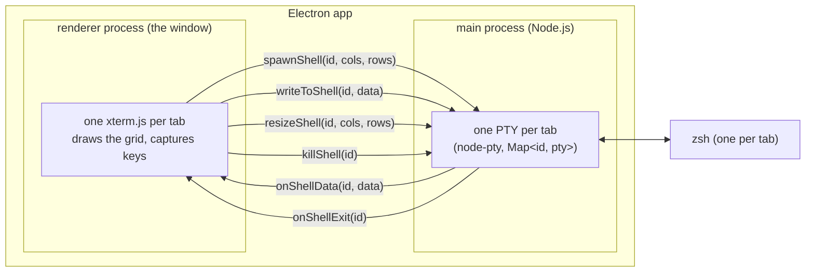
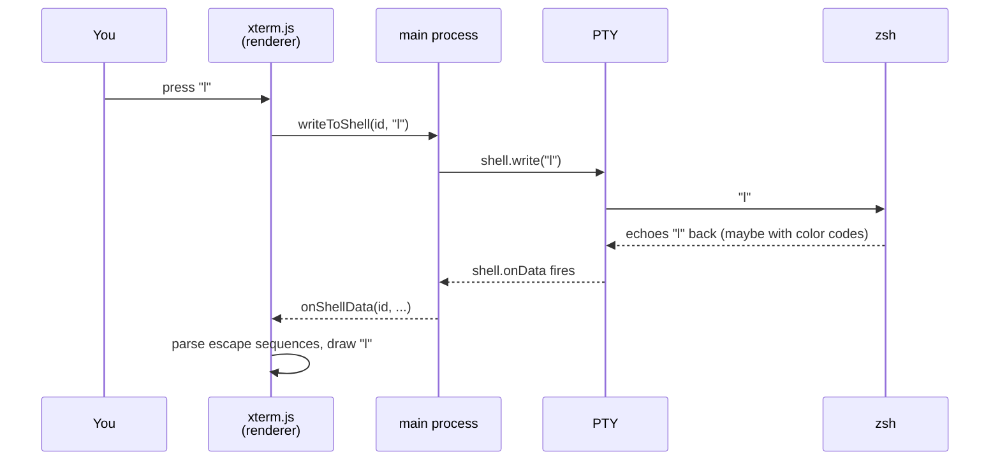

# lmux

A terminal emulator for macOS, built with [Electron](https://www.electronjs.org/)
and [xterm.js](https://xtermjs.org/), with a public command API. The project's
vocabulary is defined in [GLOSSARY.md](GLOSSARY.md).

## Run it

```sh
npm install
npm run rebuild   # recompile node-pty for Electron (see "Native module" in the glossary)
npm start         # type-checks, compiles, then launches
```

`npm run check` type-checks without launching. `npm test` drives the command
bus inside the real app and asserts on the state that comes back; it opens a
window while it runs, and exits non-zero if a case fails.

## Build it

```sh
npm run package   # a runnable lmux.app, fastest
npm run dist      # also a .dmg and a .zip
```

The build is **unsigned**, so it runs from where you built it but macOS
quarantines it if it ever arrives by download or AirDrop:

```sh
xattr -dr com.apple.quarantine /Applications/lmux.app
```

Signing and notarization need a paid Apple developer account; see #4. The
app also ships Electron's default icon until one is drawn.

## How it works

The app is two processes. Each tab pairs one xterm.js instance (renderer)
with one shell in a PTY (main); every inter-process communication message carries the tab's id so
the two sides stay paired:



All arrows between the processes pass through `window.bridge`, which the
preload script exposes to the page. The bridge also carries the command bus
and the tab and workspace context menus; its full contract is declared as a
type both sides are compiled against, and written out in ARCHITECTURE.md.

Life of a keystroke, starting when you press `l`:



The character you see is drawn in the *last* step, not the first: nothing
appears on screen until the program on the other end echoes it back.

## Where the code lives

Two sides and a cable between them, the same split the diagrams above show.
ARCHITECTURE.md walks through it: what main owns, what the renderer owns, and
what the command bus adds on top.

Main, the preload and the tests stay as one-to-one TypeScript output. The page
is built by Vite, which is what lets it import a package by name the way any
other JavaScript does. Features and abstractions get added only when needed.

## Driving lmux

Everything lmux can do is a Command, and everything that happens is
an Event. Those two unions are the whole public interface, and the UI
itself is just its first client. Try it from the devtools console (⌥⌘I):

```js
lmux.command({ type: "new-tab" })
lmux.command({ type: "write", text: "ls\n" })
lmux.command({ type: "close-tab" })
```

That door checks what it is handed: a Command that isn't one is refused
with a reason, rather than quietly doing nothing. The affordances inside
the page are compile-checked instead, and skip it.

