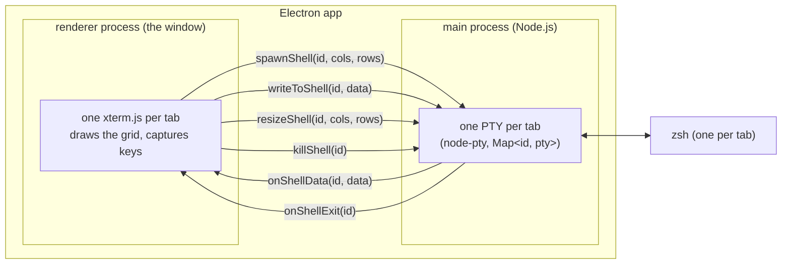
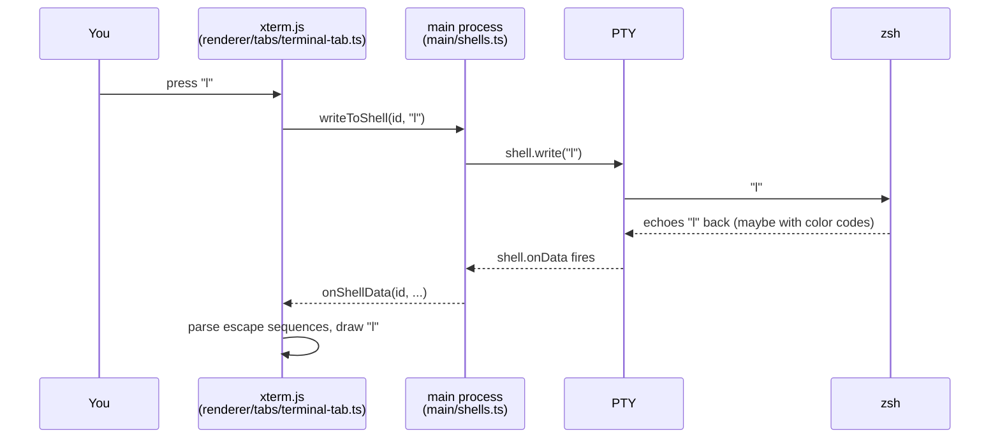

# lmux

A minimal terminal emulator for macOS, built with [Electron](https://www.electronjs.org/)
and [xterm.js](https://xtermjs.org/) as a learning project. Unfamiliar terms are
defined in [GLOSSARY.md](GLOSSARY.md).

## Run it

```sh
npm install
npm run rebuild   # recompile node-pty for Electron (see "Native module" in the glossary)
npm start         # type-checks + compiles src/ to dist/, then launches
```

`npm run check` type-checks without launching. `npm test` drives the command
bus inside the real app and asserts on the state that comes back; it opens a
window while it runs, and exits non-zero if a case fails.

## Build it

```sh
npm run package   # release/mac-arm64/lmux.app, fastest
npm run dist      # also a .dmg and a .zip
```

The build is **unsigned**, so it runs from where you built it but macOS
quarantines it if it ever arrives by download or AirDrop:

```sh
xattr -dr com.apple.quarantine /Applications/lmux.app
```

Signing and notarization need a paid Apple developer account; see #4. The
app also ships Electron's default icon until one is drawn.

## How it works

The app is two processes. Each tab pairs one xterm.js instance (renderer)
with one shell in a PTY (main); every IPC message carries the tab's id so
the two sides stay paired:



All arrows between the processes pass through `window.bridge`, which
`src/ipc/preload.cts` exposes to the page. (The bridge also carries the
command bus and the tab and workspace context menus; the full contract is
`src/ipc/bridge.ts`.)

Life of a keystroke, starting when you press `l`:



The character you see is drawn in the *last* step, not the first: like the
original hardware terminals, nothing appears on screen until the program on
the other end echoes it back.

## Files

| File                           | Role                                                         |
| ------------------------------ | ------------------------------------------------------------ |
| `src/api.ts`                   | **The public interface**: every Command in, every Event out  |
| `src/theme.ts`                 | The theme palettes (`THEMES`) and the default settings       |
| `src/session.ts`               | What a restart brings back: the session schema, read off the state |
| `src/ipc/bridge.ts`            | The IPC contract as a type (`window.bridge`)                 |
| `src/ipc/preload.cts`          | Security bridge: implements `window.bridge`, nothing else    |
| `src/main/index.ts`            | Main boot: the window and the app lifecycle                  |
| `src/main/shells.ts`           | One PTY per tab: spawn/write/resize/kill, relays data/exit   |
| `src/main/menus.ts`            | App menu + tab context menu (menu items issue Commands)      |
| `src/main/bus.ts`              | Commands in via `dispatch()`; Events out into the read model |
| `src/main/window-state.ts`     | Where the window was last time (size and position)           |
| `src/main/session-state.ts`    | The last session on disk: workspaces, tabs, documents        |
| `src/renderer/index.html`      | The page: title bar, sidebar, tab bar, panes, the modals     |
| `src/renderer/style.css`       | The page's stylesheet (theme values arrive as CSS variables) |
| `src/renderer/index.ts`        | Renderer boot: settings → CSS, cable wiring, first workspace |
| `src/renderer/bridge.ts`       | Picks `window.bridge` up off the page once, typed, and exports it |
| `src/renderer/workspaces.ts`   | Workspace store: one layout each, the sidebar, the snapshot  |
| `src/renderer/tabs/index.ts`   | Tab store + operations + `executeCommand` (the consumer)     |
| `src/renderer/tabs/terminal-tab.ts` | Terminal pane, xterm lifecycle and terminal screen reads |
| `src/renderer/tabs/markdown-tab.ts` | A document's pane: toolbar, rendered/raw, reload, its links |
| `src/renderer/tabs/markdown.ts` | GitHub-look Markdown rendering (markdown-it + DOMPurify)    |
| `src/renderer/tabs/links.ts`   | Terminal link provider: Cmd+click opens a source path or URL |
| `src/renderer/tabs/project-tab.ts` | Resizable tree, file buffers, tabs and editor lifecycle       |
| `src/renderer/tabs/project-tree.ts` | Lazy tree rows, reconciliation and Git decorations        |
| `src/renderer/tabs/code.ts`    | Monaco loading, theming and language selection               |
| `src/renderer/rename-dialog.ts`| The rename modal (tabs and workspaces)                       |
| `src/renderer/settings.ts`     | Current settings: value, localStorage persistence, → CSS     |
| `src/renderer/settings-dialog.ts`| The settings modal (each control issues a Command)         |
| `src/renderer/sidebar-resize.ts`| The sidebar's drag handle; a drag ends as one Command       |
| `src/main/files.ts`            | File reads, guarded writes and Save As                       |
| `src/main/project-tree.ts`     | Lazy directory reads, Git status and filesystem watchers     |
| `src/renderer/dom.ts`          | `requireElement`: strict, typed lookups of the page's fixed elements |
| `src/test/harness.ts`          | Boots the real app for the suite, waits for Events, tallies failures |
| `src/test/suite.ts`            | The cases: Commands in, state snapshots asserted on           |
| `tsconfig.json`                | Compiler settings; `tsc` mirrors `src/` into `dist/` 1:1     |

Application modules stay as one-to-one TypeScript output, without a framework
or an application bundler. Monaco and its worker are the one vendor-bundling
exception. Features and abstractions get added only when needed.

## Driving lmux

Everything lmux can do is a Command, and everything that happens is
an Event. The unions in [src/api.ts](src/api.ts) are the whole public
interface, and the UI itself is just its first client. Try it from the
devtools console (⌥⌘I):

```js
lmux.command({ type: "new-tab" })
lmux.command({ type: "write", text: "ls\n" })
lmux.command({ type: "close-tab" })
```

That door checks what it is handed: a Command that isn't one is refused
with a reason, rather than quietly doing nothing. The affordances inside
the page are compile-checked instead, and skip it.

## Letting an agent drive it

The same bus is on a unix domain socket, speaking [MCP](GLOSSARY.md), so an
LLM agent drives lmux through exactly the door the menu uses. MCP is
JSON-RPC over a stream, and a socket is a stream, so `nc` is the whole
client and there is no server to install:

```sh
claude mcp add --transport stdio lmux -- nc -U "$LMUX_SOCKET"
```

Run that from a terminal inside lmux, where `$LMUX_SOCKET` is set, so the
shell expands it to the real path. It is set in every shell lmux spawns,
alongside `$LMUX_TAB_ID`, which is that tab's own id. Three tools:
`command` takes any Command and answers with the state it produced, `state`
is the whole read model, and `screen` is what a tab is showing, with the
escape sequences already interpreted into the characters a human sees.

Nothing about the socket is MCP-specific. One line of JSON drives it too,
which is the quickest way to see whether it is alive (one line, because
that is the framing):

```sh
printf '%s\n' '{"jsonrpc":"2.0","id":1,"method":"tools/call","params":{"name":"command","arguments":{"command":{"type":"new-tab"}}}}' | nc -U "$LMUX_SOCKET"
```

The socket is `api.sock` in lmux's application-support directory, at 0600
inside a 0700 directory: anyone who can reach it is already you. It carries
the whole Command union, `write` included, so an agent holding it can run
programs. That is the feature, and it is the reason it is not a network
port.
